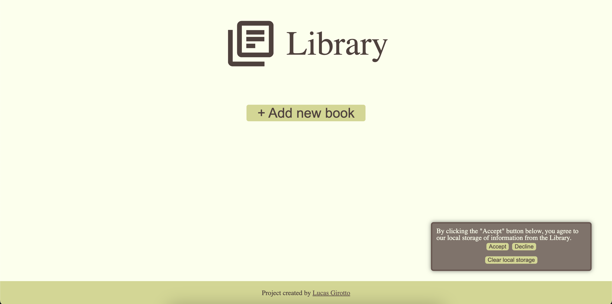
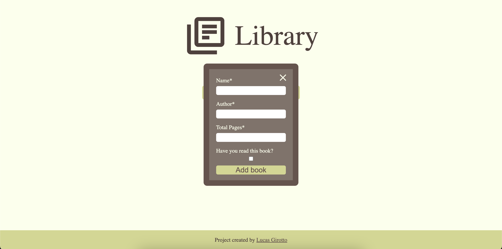
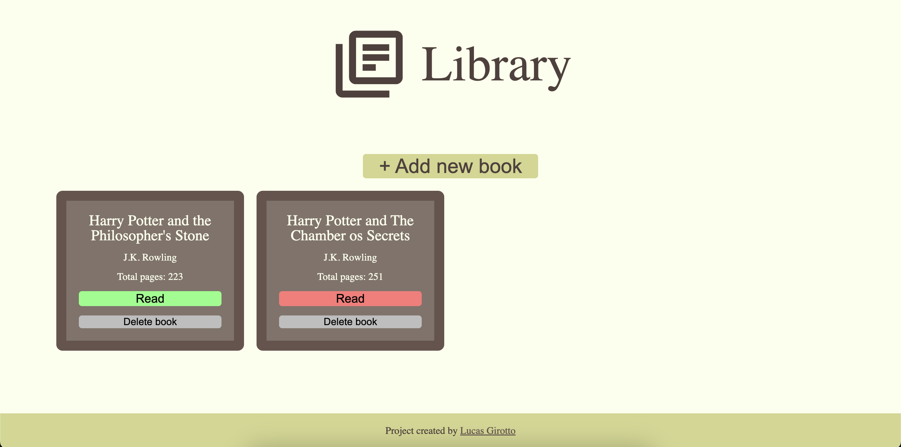

<!-- PROJECT SHIELDS -->
[![LinkedIn][linkedin-shield]][linkedin-url]

<!-- PROJECT LOGO -->
 

  

<h3 align="center">E-Library</h3>

  

    An online Library system that stores information about books the user has or hasn't read.
     
     
    <a href="https://maoaii.github.io/E-Library/">View Demo</a>
    ·
    <a href="https://github.com/Maoaii/E-Library/issues">Report Bug</a>
    ·
    <a href="https://github.com/Maoaii/E-Library/issues">Request Feature</a>
  

<!-- TABLE OF CONTENTS -->

  
Table of Contents

  <ol>
    <li>
      <a href="#about-the-project">About The Project</a>
      <ul>
        <li><a href="#built-with">Built With</a></li>
      </ul>
    </li>
    <li><a href="#license">License</a></li>
    <li><a href="#contact">Contact</a></li>
  </ol>

<!-- ABOUT THE PROJECT -->
## About The Project

The Library was build with local storage in mind, so, by default, the user agrees to it. However, there's a popup in which the user can disagree to using it and the books won't be stored (defeats a bit the purpose of the project).

There's a Home page allows the user to add new books to the library.

 
 
 

There's an Add Books page where the user can insert the information regarding a certain book they're interested in.

 
 
 

After adding a new book, it will be displayed in the Home Page. 
The user can then toggle the "read" status of that book or delete it.

 

(<a href="#readme-top">back to top</a>)

### Built With
* [![HTML][HTML.com]][HTML-url]
* [![CSS][CSS.com]][CSS-url]
* [![JavaScript][JavaScript.com]][JavaScript-url]
* [![local_storage][local_storage.com]][local_storage-url]

(<a href="#readme-top">back to top</a>)

<!-- LICENSE -->
## License

Distributed under the MIT License. See `LICENSE` for more information.

(<a href="#readme-top">back to top</a>)

<!-- CONTACT -->
## Contact

Lucas Girotto - l.girottoph@gmail.com

Project Link: [https://maoaii.github.io/E-Library/](https://maoaii.github.io/E-Library/)

(<a href="#readme-top">back to top</a>)

<!-- MARKDOWN LINKS & IMAGES -->
<!-- https://www.markdownguide.org/basic-syntax/#reference-style-links -->
[linkedin-shield]: https://img.shields.io/badge/-LinkedIn-black.svg?style=for-the-badge&logo=linkedin&colorB=555
[linkedin-url]: https://linkedin.com/in/lucas-girotto-4530b9233

[product-screenshot]: images/screenshot.png

[HTML.com]: https://img.shields.io/badge/HTML-orange?style=for-the-badge&&logoColor=white
[HTML-url]: https://developer.mozilla.org/en-US/docs/Web/HTML

[CSS.com]: https://img.shields.io/badge/CSS-blue?style=for-the-badge&&logoColor=white
[CSS-url]: [https://developer.mozilla.org/en-US/docs/Web/HTML](https://developer.mozilla.org/en-US/docs/Web/CSS)

[JavaScript.com]: https://img.shields.io/badge/JS-yellow?style=for-the-badge&&logoColor=white
[JavaScript-url]: https://developer.mozilla.org/en-US/docs/Web/JavaScript

[local_storage.com]: https://img.shields.io/badge/local_storage-grey?style=for-the-badge&&logoColor=white
[local_storage-url]: https://developer.mozilla.org/en-US/docs/Web/API/Web_Storage_API
